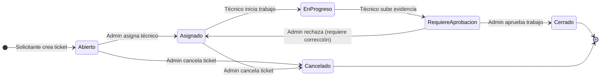
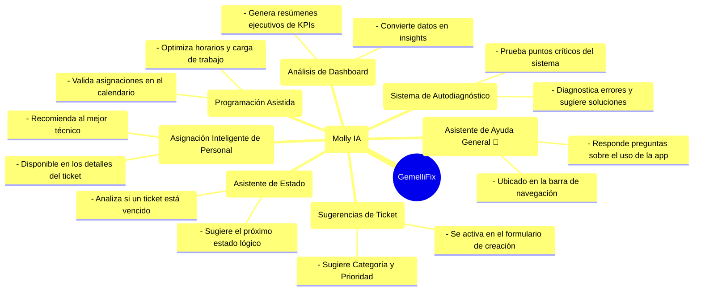

# GemelliFix: Sistema Inteligente de Gestión de Mantenimiento


Bienvenido a GemelliFix, la solución integral para la gestión de solicitudes y operaciones de mantenimiento del Colegio Franciscano Agustín Gemelli. Esta aplicación está diseñada para optimizar, agilizar y transparentar todo el ciclo de vida de un ticket de mantenimiento, desde su creación hasta su resolución, potenciada por una capa de inteligencia artificial que asiste a los usuarios en cada paso.

## 🚀 ¿Cómo Empezar?

Para ejecutar la aplicación en tu entorno de desarrollo local, sigue estos pasos:

1.  **Instalar Dependencias:**
    ```bash
    npm install
    ```
2.  **Iniciar el Servidor de Desarrollo:**
    ```bash
    npm run dev
    ```
3.  Abre tu navegador y visita [http://localhost:9002](http://localhost:9002).

## 📊 Arquitectura y Diagramas del Sistema

Para una comprensión más clara de la aplicación, a continuación se presentan diagramas que ilustran sus componentes clave.

### 1. Arquitectura de Roles de Usuario

Este diagrama muestra los permisos y capacidades de cada rol dentro de GemelliFix.

```mermaid
graph TD
    subgraph "Roles de Usuario"
        A(Administrador)
        B(Servicios Generales)
        C(SST - Auditor)
        D(Solicitantes)
    end

    subgraph "Acciones"
        Accion1[Ver Todos los Tickets y Dashboard]
        Accion2[Crear/Editar/Asignar/Eliminar Tickets]
        Accion3[Gestionar Configuración (Usuarios, Zonas, etc.)]
        Accion4[Ver Solo Tickets Asignados]
        Accion5[Actualizar Progreso y Subir Evidencia]
        Accion6[Crear Nuevos Tickets]
        Accion7[Ver Solo Tickets Propios]
    end

    A --> Accion1
    A --> Accion2
    A --> Accion3

    B --> Accion4
    B --> Accion5

    C --> Accion1

    D --> Accion6
    D --> Accion7
```

### 2. Ciclo de Vida de un Ticket

Este diagrama de estado ilustra el flujo de trabajo de un ticket de mantenimiento desde su creación hasta su resolución final.



### 3. Ecosistema de Inteligencia Artificial "Molly IA"

Molly IA es una capa de inteligencia distribuida en toda la aplicación para asistir en diferentes tareas.



## 👤 Roles de Usuario

La aplicación cuenta con un sistema de roles para asegurar que cada usuario tenga acceso únicamente a las funcionalidades que le corresponden.

-   **Administrador (`Administrador`):**
    -   **Control total.** Puede crear, ver, editar, asignar y eliminar cualquier ticket.
    -   Gestiona usuarios, zonas, sitios y categorías desde el panel de **Configuración**.
    -   Tiene acceso al **Dashboard** de KPIs, al **Calendario Operativo** y a la página de **Diagnóstico**.

-   **Servicios Generales (`Servicios Generales`):**
    -   Es el personal técnico que resuelve las incidencias.
    -   Puede ver y gestionar **únicamente los tickets que se le han asignado**.
    -   Puede cambiar el estado de sus tickets, añadir comentarios y subir evidencia fotográfica del trabajo realizado.
    -   Tiene acceso a su propio **Calendario** para ver sus tareas y turnos.

-   **Seguridad y Salud en el Trabajo (`SST`):**
    -   Rol de **solo lectura**.
    -   Puede ver todos los tickets y el **Dashboard** con fines de auditoría y seguimiento.
    -   No puede crear, editar ni modificar ninguna solicitud.

-   **Solicitantes (`Docentes`, `Coordinadores`, `Administrativos`):**
    -   Son los usuarios que reportan las incidencias.
    -   Pueden **crear nuevos tickets** de mantenimiento.
    -   Pueden ver y dar seguimiento al estado de **sus propias solicitudes** únicamente.

## ✨ Inteligencia Artificial Integrada

GemelliFix está potenciado por "Molly IA", un conjunto de asistentes inteligentes diseñados para hacer tu trabajo más fácil, rápido y eficiente. Aquí te explicamos todas las funcionalidades de IA y dónde encontrarlas:

---

### 1. Asistente de Ayuda General (Molly IA)

-   **¿Dónde se encuentra?:** En la esquina superior derecha de la aplicación, busca el **ícono de un robot (🤖)**.
-   **¿Qué hace por ti?:** Es tu guía experta. Puedes preguntarle cualquier cosa sobre cómo usar la aplicación en lenguaje natural. Por ejemplo:
    -   *"¿Cómo puedo crear un ticket?"*
    -   *"¿Quién puede ver mis solicitudes?"*
    -   *"¿Qué significa un ticket 'En Progreso'?"*
    Molly IA te dará una respuesta clara y concisa al instante.

---

### 2. Sugerencias al Crear un Ticket

-   **¿Dónde se encuentra?:** En el formulario de **Crear Nueva Solicitud**.
-   **¿Qué hace por ti?:** Después de que escribas un **Título** y una **Descripción** para tu ticket, aparecerá un botón **"Analizar con IA"**. Al hacer clic, la IA leerá tu texto y te sugerirá automáticamente la **Categoría** y la **Prioridad** más adecuadas para la incidencia, ahorrándote tiempo y mejorando la clasificación.

---

### 3. Asignación Inteligente de Personal

-   **¿Dónde se encuentra?:** En la página de **detalles de un ticket**, en el panel derecho.
-   **¿Qué hace por ti?:** Para los administradores, el botón **"Asignar Personal con IA"** es un potente asistente. La IA analiza el contenido del ticket, revisa la carga de trabajo actual de todo el personal de Servicios Generales y te recomienda al técnico más idóneo para resolver esa tarea específica, optimizando los recursos.

---

### 4. Asistente de Estado del Ticket

-   **¿Dónde se encuentra?:** En los **detalles de un ticket**, junto al menú para cambiar el estado.
-   **¿Qué hace por ti?:** Al hacer clic en el ícono de chispas (✨), la IA evalúa la situación del ticket.
    -   Si el ticket está **vencido**, te alertará sobre el retraso y te sugerirá acciones, como contactar al técnico.
    -   Si el ticket está al día, te sugerirá el **siguiente paso lógico** en el flujo de trabajo (por ejemplo, cambiar de "Asignado" a "Requiere Aprobación").

---

### 5. Programación Asistida por IA en el Calendario

-   **¿Dónde se encuentra?:** En la página del **Calendario**.
-   **¿Qué hace por ti?:** Cuando un Administrador arrastra un ticket sin asignar y lo suelta sobre el horario de un técnico, la IA interviene para validar la acción. Analiza la disponibilidad del técnico, su carga de trabajo y el SLA del ticket para:
    -   **Confirmar** si es una buena asignación.
    -   **Sugerir una hora diferente** si hay un conflicto.
    -   **Recomendar a otro técnico** si está más capacitado o tiene menos carga de trabajo.

---

### 6. Análisis Ejecutivo del Dashboard

-   **¿Dónde se encuentra?:** En la página principal del **Dashboard**.
-   **¿Qué hace por ti?:** El botón **"Analizar con IA"** convierte los datos y gráficos en conocimiento accionable. La IA analiza todos los indicadores clave (KPIs) y genera un **resumen ejecutivo en español**, como lo haría un director de operaciones, destacando los éxitos y señalando las áreas que requieren atención.

---

### 7. Sistema de Autodiagnóstico y Reparación

-   **¿Dónde se encuentra?:** En la página de **Diagnóstico**, accesible desde el menú lateral para Administradores.
-   **¿Qué hace por ti?:** Esta es la funcionalidad de IA más avanzada. Te permite ejecutar pruebas en puntos críticos de la aplicación (conexión a la base de datos, API de calendario, etc.). Si una prueba falla, la IA no solo te notifica, sino que **analiza el código de error específico**, te explica la **causa raíz del problema** y te proporciona una **guía con los pasos sugeridos** para solucionarlo.

## 🛠️ Funcionalidades Principales

-   **Gestión de Tickets:** Crea, visualiza, filtra y actualiza solicitudes de mantenimiento. Cada ticket tiene un historial completo de cambios y comentarios.
-   **Calendario Operativo:** Visualiza la carga de trabajo del personal, programa turnos, y asigna tareas o tickets mediante una interfaz de arrastrar y soltar (drag & drop).
-   **Dashboard de KPIs:** Monitorea en tiempo real los indicadores clave de rendimiento, como el número de tickets abiertos/vencidos, el cumplimiento de SLA y los tiempos de resolución.
-   **Gestión de Usuarios y Datos Maestros:** Los administradores pueden añadir nuevos usuarios y gestionar las Zonas, Sitios y Categorías que se usan en toda la aplicación.
-   **Notificaciones:** Un centro de notificaciones integrado te mantiene al tanto de las actualizaciones importantes sobre tus tickets o asignaciones.

## 💻 Pila Tecnológica

-   **Framework:** Next.js (con App Router)
-   **Lenguaje:** TypeScript
-   **Estilos:** Tailwind CSS
-   **Componentes UI:** shadcn/ui
-   **Backend y Base de Datos:** Firebase (Firestore, Auth, Storage)
-   **Inteligencia Artificial:** Genkit (Google AI)
-   **Cloud Functions:** Para lógica de servidor y notificaciones.
