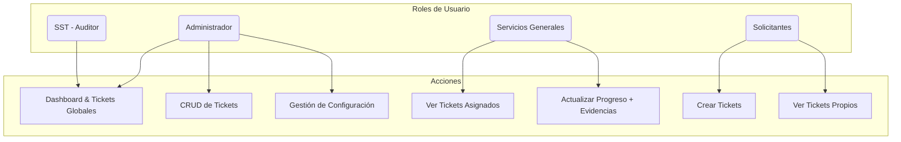
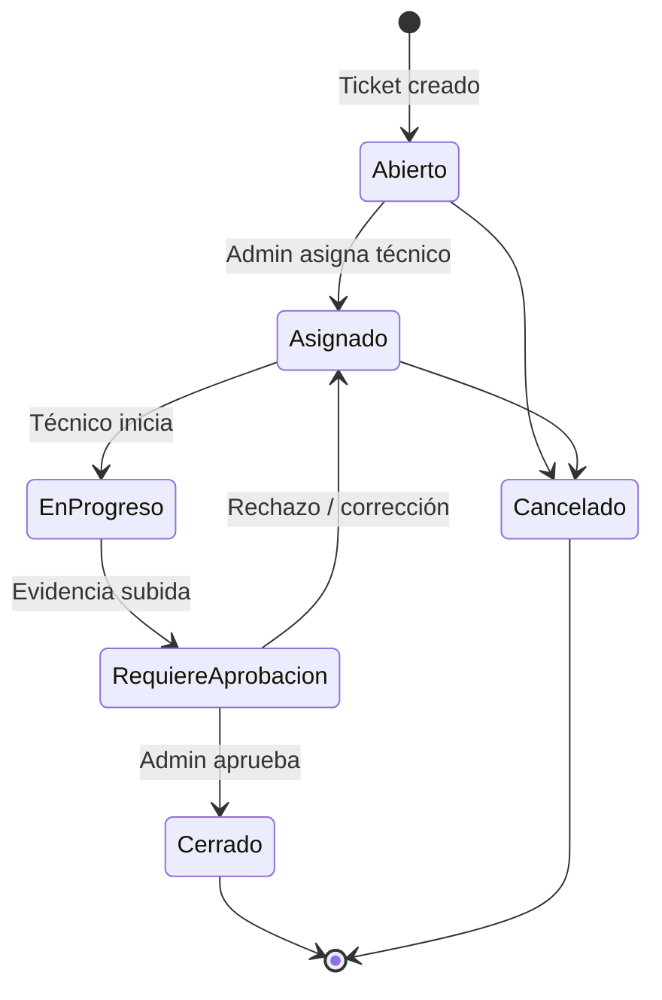
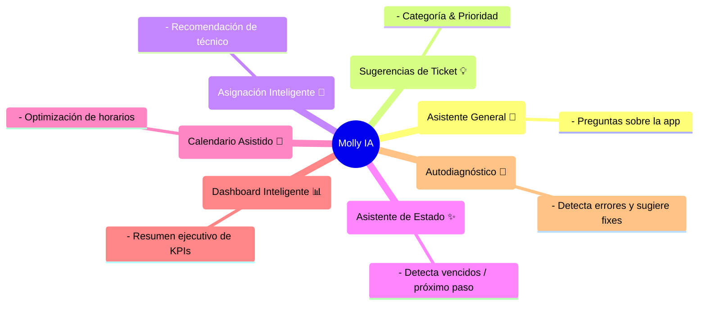

# 🛠️ GemelliFix: Sistema Inteligente de Gestión de Mantenimiento

<p align="center">
  
</p>

<p align="center">
  <b>Gestión integral de mantenimiento, optimizada con Inteligencia Artificial para el Colegio Franciscano Agustín Gemelli</b>
</p>

---

## 🚀 Inicio Rápido

```bash
# Instalar dependencias
npm install

# Ejecutar servidor de desarrollo
npm run dev
```

👉 Luego visita: [http://localhost:9002](http://localhost:9002)

---

## 📊 Arquitectura del Sistema

### Roles de Usuario


### Ciclo de Vida de un Ticket


---

## 🤖 Molly IA: Inteligencia Artificial Integrada



---

## 👥 Roles en Detalle

- **Administrador 👑**
  - Control total: usuarios, zonas, tickets, categorías.
  - Acceso a **Dashboard**, **Calendario** y **Diagnóstico**.

- **Servicios Generales 🛠️**
  - Técnicos que resuelven incidencias.
  - Solo ven y actualizan tickets asignados.

- **SST (Auditoría) 🔍**
  - Rol de lectura: visualiza Dashboard y tickets.

- **Solicitantes ✏️**
  - Docentes, coordinadores y administrativos.
  - Crean tickets y revisan solo los propios.

---

## ✨ Funcionalidades Principales

- 🎫 **Gestión de Tickets:** CRUD + historial y comentarios.  
- 📅 **Calendario Operativo:** turnos, tareas y drag & drop.  
- 📊 **Dashboard de KPIs:** cumplimiento de SLA, tickets vencidos, tiempos medios.  
- 👥 **Gestión de Usuarios y Datos Maestros.**  
- 🔔 **Centro de Notificaciones.**

---

## 🛠️ Stack Tecnológico

- **Framework:** Next.js 15 + App Router  
- **Lenguaje:** TypeScript  
- **UI:** Tailwind + shadcn/ui  
- **Backend & DB:** Firebase (Firestore, Auth, Storage)  
- **IA:** Genkit (Google AI)  
- **Cloud Functions:** automatización de lógica y alertas  

---

## 🌟 Screenshots (pendiente incluir)

- 📊 Dashboard con métricas SLA.  
- 📅 Calendario con asignaciones.  
- 🎫 Flujo de creación de ticket con Molly IA.  

---

<p align="center">
  Hecho con ❤️ para la comunidad educativa del Colegio Franciscano Agustín Gemelli
</p>
