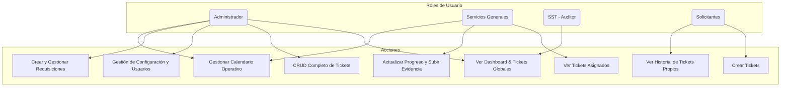
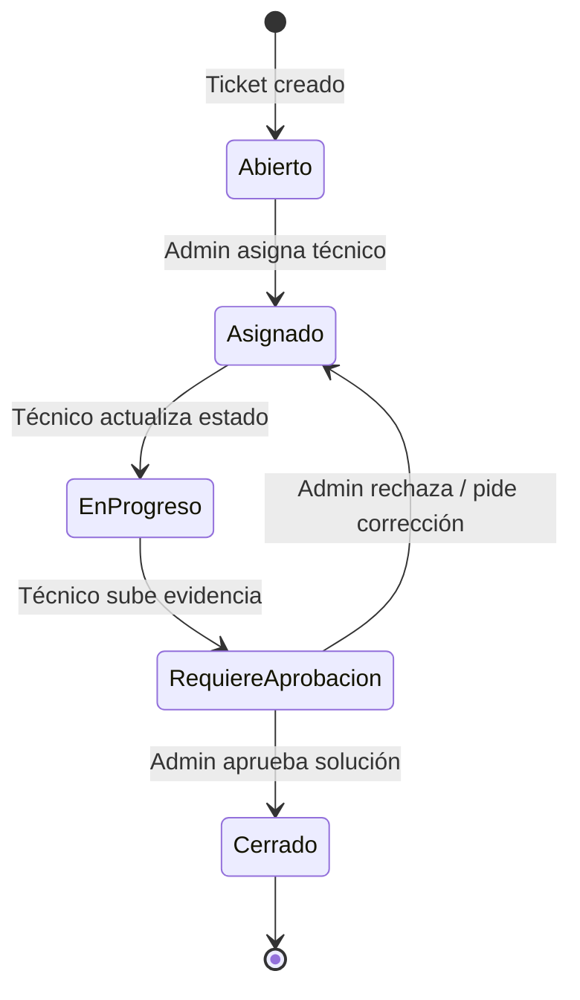
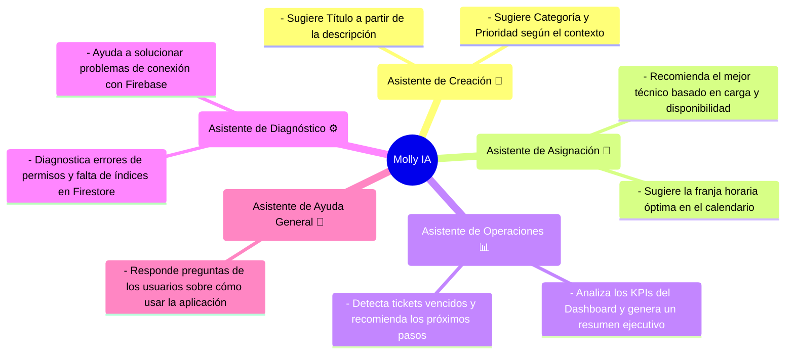

# 🛠️ GemelliFix: Sistema Inteligente de Gestión de Mantenimiento

<p align="center">
  
</p>

<p align="center">
  <b>Gestión integral de mantenimiento, optimizada con Inteligencia Artificial para el Colegio Franciscano Agustín Gemelli</b>
</p>

---

## 🚀 Inicio Rápido

```bash
# 1. Instalar dependencias
npm install

# 2. Ejecutar servidor de desarrollo
npm run dev
```

👉 Luego visita: [http://localhost:9002](http://localhost:9002)

---

## 🔒 Supabase y Seguridad de Datos

Este proyecto utiliza [Supabase](https://supabase.com) para ciertas operaciones de backend.

- Las tablas están protegidas mediante **Row Level Security (RLS)**. Ejemplos de políticas se incluyen en `supabase/policies.sql`.
- Para tareas administrativas desde el servidor, configura la variable `SUPABASE_SERVICE_ROLE_KEY` y evita exponerla en el cliente.
- En el navegador solo debe usarse `NEXT_PUBLIC_SUPABASE_ANON_KEY` con permisos limitados.

---

## 🏛️ Arquitectura del Sistema

### Roles de Usuario


### Ciclo de Vida de un Ticket


---

## 🤖 Molly IA: Inteligencia Artificial Integrada

El sistema está potenciado por **Molly IA**, un conjunto de asistentes inteligentes diseñados para optimizar cada paso del proceso de mantenimiento.



---
## 📋 Módulos Principales

-   **Dashboard**: Vista de pájaro de toda la operación. Ofrece métricas clave (KPIs) como cumplimiento de SLA, tiempos de resolución, tickets vencidos y gráficos interactivos sobre zonas, categorías y productividad del equipo. Los usuarios no administradores ven una versión simplificada con sus propias estadísticas.
-   **Solicitudes (Tickets)**: El corazón del sistema. Permite la creación, visualización, asignación y seguimiento de todas las incidencias. Incluye un historial detallado, sistema de comentarios y gestión de archivos adjuntos y evidencias.
-   **Requisiciones**: Módulo para la gestión de solicitudes de compra de materiales o servicios necesarios para el mantenimiento. Permite crear, aprobar y seguir el estado de cada ítem.
-   **Calendario Operativo**: Herramienta visual para programar turnos y asignar tareas al personal de Servicios Generales. Permite la creación de eventos recurrentes y asignaciones inteligentes sugeridas por la IA.
-   **Configuración**: Panel de control para el Administrador. Permite gestionar usuarios (crear, editar roles), zonas, sitios y categorías que alimentan los formularios del sistema.
-   **Diagnóstico**: Página técnica para el Administrador que permite ejecutar pruebas de conectividad con Firebase, verificar reglas de seguridad y permisos de usuario, y obtener diagnósticos de la IA para solucionar problemas comunes.

---

## 👥 Roles en Detalle

-   **Administrador 👑**
    -   Control total sobre todos los módulos.
    -   Gestiona usuarios, zonas, sitios, categorías y requisiciones.
    -   Asigna tickets, aprueba soluciones y tiene acceso a todas las métricas.
    -   Utiliza el módulo de **Diagnóstico** para la salud del sistema.

-   **Servicios Generales 🛠️**
    -   El equipo técnico que resuelve las incidencias.
    -   Visualiza y actualiza únicamente los tickets que se le han asignado.
    -   Sube evidencia fotográfica del trabajo realizado.
    -   Puede ver su propia agenda en el **Calendario**.

-   **SST (Auditoría) 🔍**
    -   Rol de solo lectura para supervisión y auditoría.
    -   Tiene acceso completo al **Dashboard** y puede ver todos los tickets, pero no puede realizar modificaciones.

-   **Solicitantes (Docentes, Coordinadores, etc.) ✏️**
    -   Crean nuevas solicitudes de mantenimiento (tickets).
    -   Pueden ver el estado y el historial de sus propias solicitudes únicamente.
    -   Responden la encuesta de satisfacción una vez que su ticket es cerrado.

---

## 🛠️ Stack Tecnológico

-   **Framework**: Next.js 15 + App Router
-   **Lenguaje**: TypeScript
-   **UI**: Tailwind CSS + shadcn/ui
-   **Backend & DB**: Firebase (Firestore, Authentication, Storage)
-   **Inteligencia Artificial**: Genkit (Google AI - Gemini)
-   **Cloud Functions**: Automatización de lógica de negocio y notificaciones.

---

<p align="center">
  Hecho con ❤️ para la comunidad educativa del Colegio Franciscano Agustín Gemelli
</p>
